# Basic Pentesting

> *Una receta para encontrar vulnerabilidades, contada como si estuviéramos cocinando un pachamanca: aromas, pasos, condimentos y —al final— el bocado que nos llena de emoción. pero si quieres tener ladocumentacion te la dejo aqui*

  

---

## 🧑‍🍳 Introducción (Entrada caliente)

“Basic Pentesting: TryHackMe” escrito por **kana**. Guia una práctica de pentesting en TryHackMe que cubre: enumeración, explotación y escalada de privilegios —con herramientas clásicas— para completar un CTF didáctico.

## 🥣 Ingredientes principales (Herramientas y conceptos)

En nuestra cocina de seguridad utilizamos las siguientes “especias” y utensilios fundamentales:

* **Nmap** — para olfatear puertos y servicios.
* **Nikto**, **Gobuster** — para raspar y buscar directorios/archivos en servidores web.
* **enum4linux**, **smbclient** — para olfatear y leer recursos SMB.
* **Nmap NSE / ssh-brute** o **Hydra** — para ataques de fuerza bruta sobre SSH.
* **LinEnum / LinPeas** — para automatizar la búsqueda de vectores de escalada en Linux.
* **scp**, **ssh**, **John the Ripper** — para mover archivos, autenticarnos y quebrar claves cifradas.
  Estos elementos aparecen en el writeup como los pasos y herramientas clave para avanzar en el reto.

---

## 🔥 Preparación paso a paso (La receta)

Imagina que estás en una cocina: cada fase del pentest es como preparar una parte del plato.

### 1. Mise en place — Despliegue y escaneo

* Se despliega la máquina objetivo en TryHackMe y se lanza un escaneo Nmap para ver puertos abiertos. El autor encontró múltiples puertos abiertos (seis en su ejemplo), lo que ya nos da una buena base para seguir husmeando.

*A continuación se muestran capturas del escaneo Nmap y resultados iniciales.*

> En la imagen se ve haciendo un `nmap` para todos los puertos abiertos y nos muestarn el puerto 22 y 80.

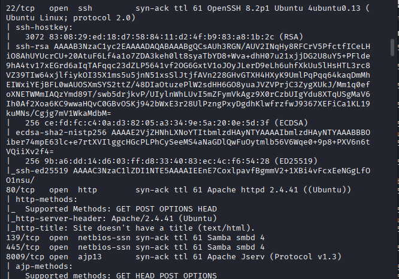
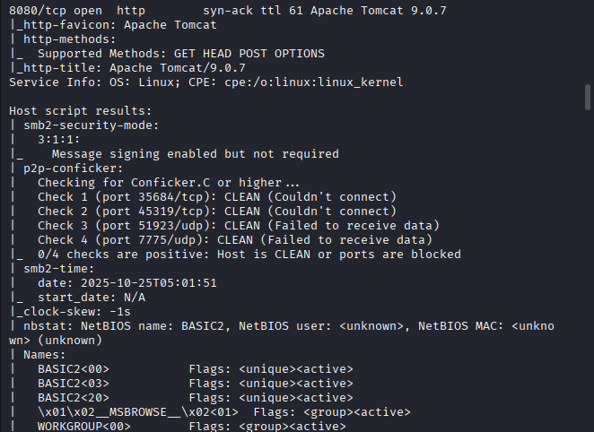

---

### 2. Degustación del front-end — Enumeración HTTP

* Abrimos la web y, al inspeccionar la fuente, hay una pista: un comentario que apunta a una sección `dev` —¡una especia escondida!

*Capturas de la enumeración web y descubrimiento de `/development/`.*

> Aqui vemos la enumeración con `nikto` y resultados
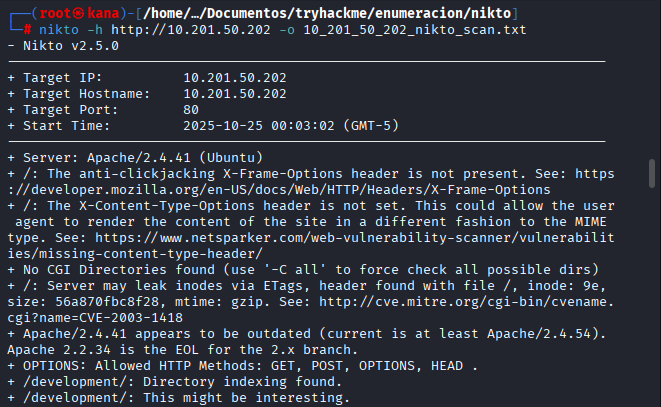

> Aqui vemos la enumeración con `gobuster` integrando dos variables `TARGET_IP` con la ip de la victima y `wordlist` con la ruta de script 
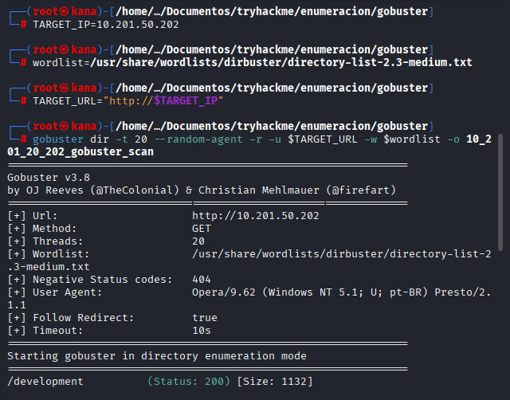

* Se usa **Nikto** para escanear el servidor web y **Gobuster** para descubrir directorios. Ambos devolvieron rutas interesantes, entre ellas `/development/`, que ocultaba archivos con información jugosa. 

**Hallazgo clave:** `/development/` (archivo `dev.txt` y `j.txt`) — contiene una conversación y pistas sobre usuarios y contraseñas.

> Aqui se ve la paginas econtradas por `nikto` y `gobuster` 

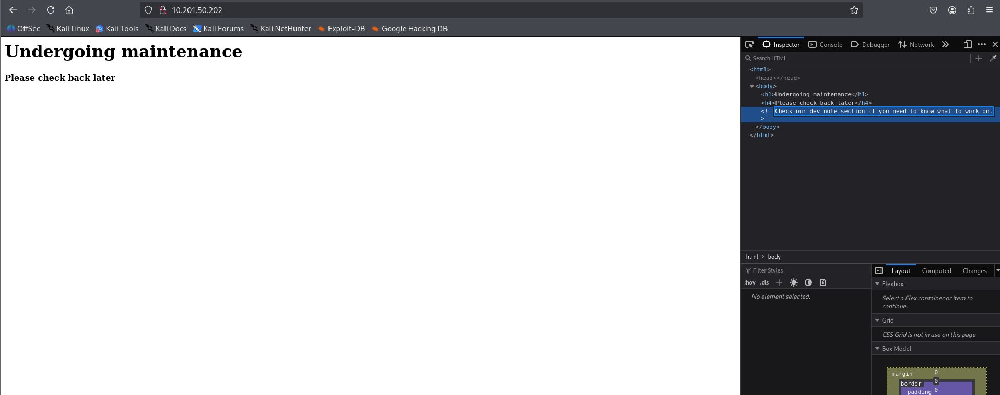

> se encontro en la ruta `/development` los archivos `dev.txt` y `j.txt` 
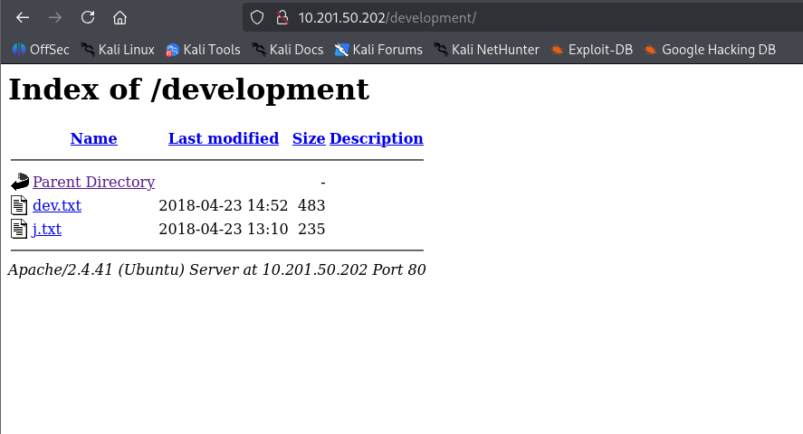

> revisamos ocntenido de archivo `dev.txt`
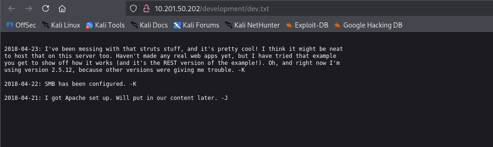

> y obviamente del archivo `j.txt`
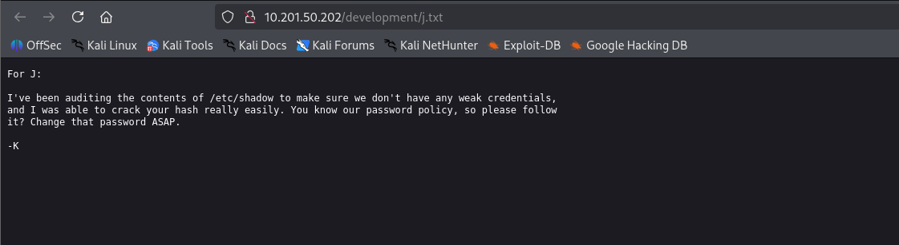

---

### 3. Hurgando en la despensa — SMB Enumeration

* Con **enum4linux** se descubre que existe una cuenta anónima y un recurso compartido accesible. Ahí se encontró un `staff.txt` con nombres completos: **Jan** y **Kay**, conectando las pistas del sitio web con usuarios del sistema.

*Capturas relacionadas con SMB y enum4linux/smbclient.*

> se ve el script utilizando `enum4linu` y resultados
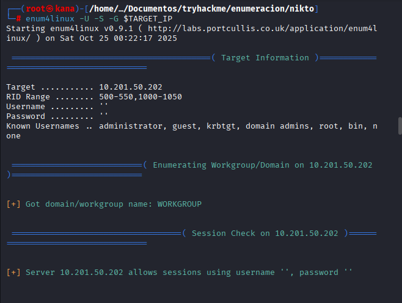
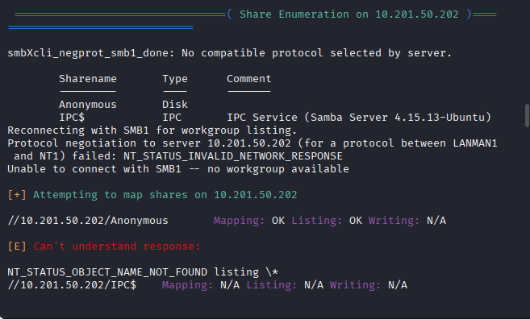

Se econtro un archivo `Anonymous` eso se hara con la erramienta **smbcliente** a este archivo 

> se utiliza el smbcliente con el ruta `/Anonymous` y se lista los archivos encontrados que es `staff.txt`
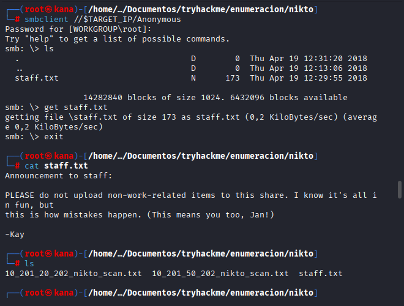

> se ve el contenido del archivo `staff.txt` encontrado

---

### 4. El golpe maestro — Explotación (Brute-force SSH)

* Con la lista de usuarios (`jan`, `kay`) y una wordlist (ej. `rockyou.txt`), se empleó el script NSE `ssh-brute` de Nmap (o alternativamente **Hydra**) para forzar credenciales SSH.
* Resultado: credenciales válidas encontradas: **usuario** `Jan` con **contraseña** `Armando` (se accede por SSH). ¡Bocado conseguido! 

*Capturas del intento de conexión SSH, resultado de brute-force y acceso.*

*Capturas de la enumeración web y descubrimiento de `/development/`.*

> primero se hace la busque de de un script con la palabra `ssh` en la banca de nmap 
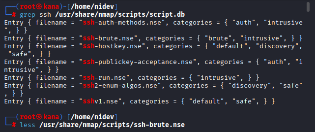

> se colo las variables o atributos que nos pide el scripts  
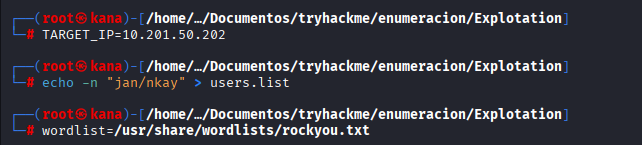

> se ve el script de un ataque de fuerza bruta con `nmap` con un script `ssh-brute` y algunos argumentos que nos pide
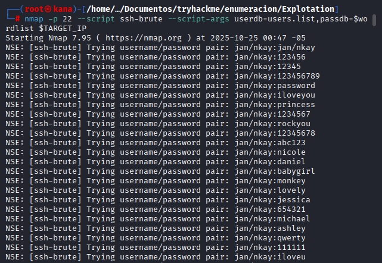

> resultado que encontro el `ssh-brute` 

> realizamos un ingreso por `ssh` con el usuario `jan` y el password `armando` que encontramos
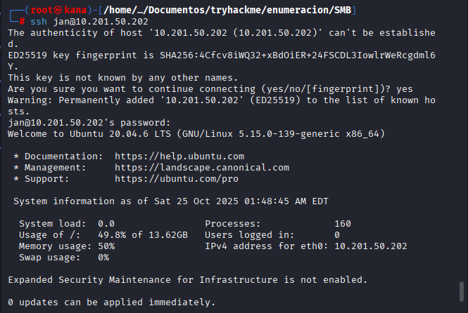
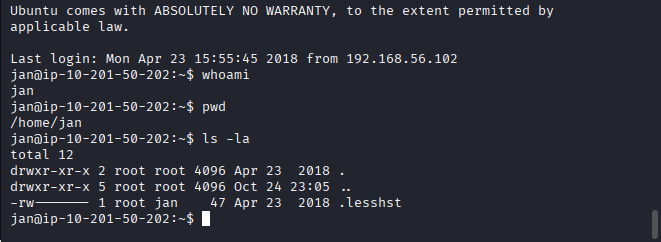

---

### 5. El postre — Escalada de privilegios

* Una vez dentro como `jan`, se realiza una nueva enumeración (manual y con LinEnum/LinPeas). Ahí aparece algo muy sabroso: en el home de **kay** existe `.ssh/id_rsa` (clave privada) con permisos peligrosos.

Antes de eso utilizaremos un herramienta **Linenum** para subir privigeios

> clonamos el repositorio `LinEnum` 
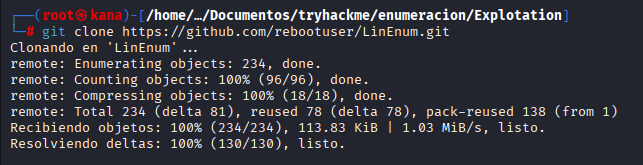

> hacemos un listener con `python3`
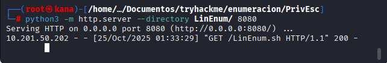

> hacemos el `wget` enviando la herramienta clonada `LinEnum` subimos privilegios para ejecutarlo en la maquina 
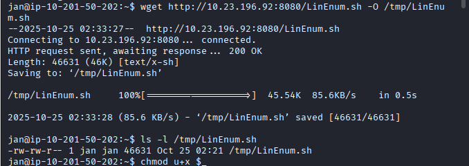

> ejecucion de `LinEnum`
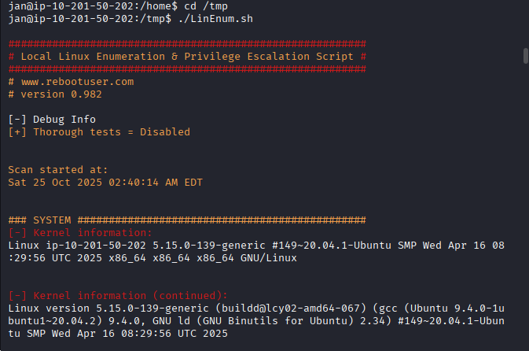

> resultados
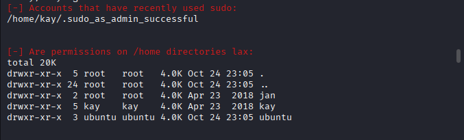

> al entrar el home de usuariio `kay` encontramos el archivo que buscamos `./ssh/id_rsa`
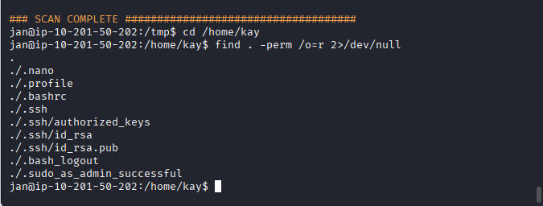

* Se copia la clave (`scp`) y, tras ajustar permisos, se descubre que la clave privada está protegida por una passphrase. Usando **John the Ripper** se quiebra la passphrase; con ello se logra el acceso a la cuenta `kay`. Desde `kay` (miembro de `sudo`), se obtiene la contraseña final/flag:
  `heresareallystrongpasswordthatfollowsthepasswordpolicy$$`.

*Capturas de la búsqueda de archivos sensibles, copia de `id_rsa`, cracking de passphrase y escalada final.*

> al entrar el home de usuariio `kay` encontramos el archivo que buscamos `./ssh/id_rsa`

> enviamos a la maquina atacante el `id_rsa`
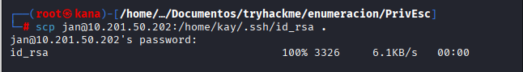

> ingresamos al usuario `kay` con el password del archivo `id_rsa` pero no nos deja por la clave de hash
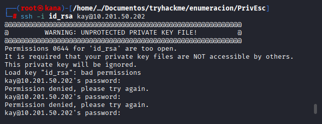

> intentamos aumentando permisos de ejecucion y tampoco

> para eso hacemos un ataque JohnTheRipper e ingresamos con la contraseña que encontramos `beeswax` del susario `kay`
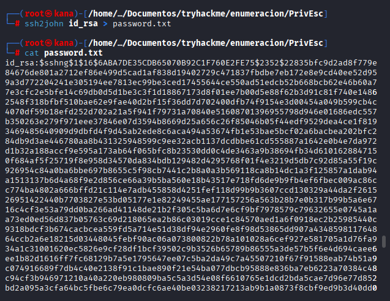
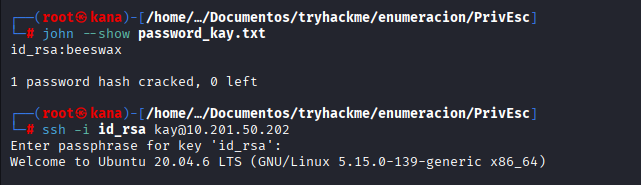

>> Buscamos la clave y lo encontramos
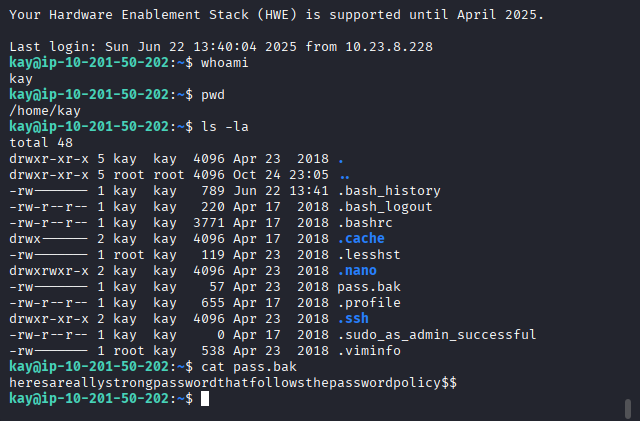
