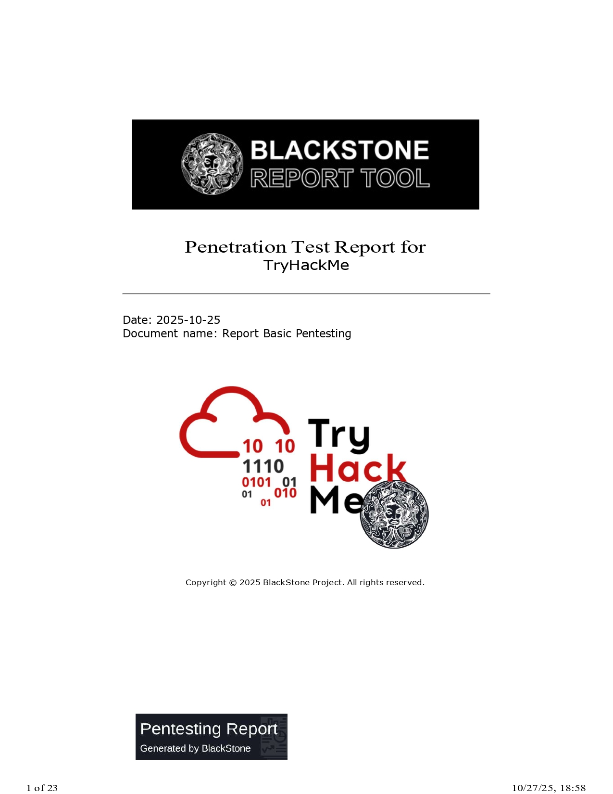
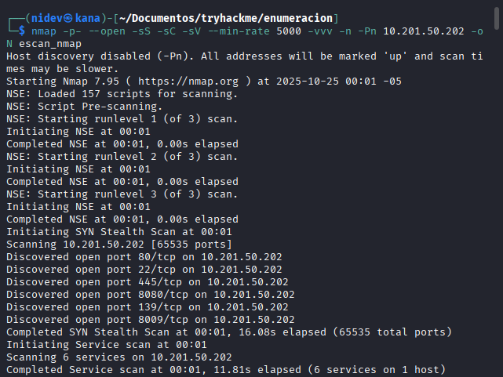

# Basic Pentesting

> *Una receta para encontrar vulnerabilidades, contada como si estuviéramos cocinando un pachamanca: aromas, pasos, condimentos y —al final— el bocado que nos llena de emoción. pero si quieres tener ladocumentacion te la dejo aqui*

  

---

## 🧑‍🍳 Introducción (Entrada caliente)

**writeup** “Basic Pentesting: TryHackMe” escrito por **nidev**. Guia una práctica de pentesting en TryHackMe que cubre: enumeración, explotación y escalada de privilegios —con herramientas clásicas— para completar un CTF didáctico.

> En la imagen se ve un ping con solo 1 paquete el `-c` con la IP de la máquina que es `10.201.50.202`.

---

## 🥣 Ingredientes principales (Herramientas y conceptos)

En nuestra cocina de seguridad utilizamos las siguientes “especias” y utensilios fundamentales:

* **Nmap** — para olfatear puertos y servicios.
* **Nikto**, **Gobuster** — para raspar y buscar directorios/archivos en servidores web.
* **enum4linux**, **smbclient** — para olfatear y leer recursos SMB.
* **Nmap NSE / ssh-brute** o **Hydra** — para ataques de fuerza bruta sobre SSH.
* **LinEnum / LinPeas** — para automatizar la búsqueda de vectores de escalada en Linux.
* **scp**, **ssh**, **John the Ripper** — para mover archivos, autenticarnos y quebrar claves cifradas.
  Estos elementos aparecen en el writeup como los pasos y herramientas clave para avanzar en el reto.

---

## 🔥 Preparación paso a paso (La receta)

Imagina que estás en una cocina: cada fase del pentest es como preparar una parte del plato.

### 1. Mise en place — Despliegue y escaneo

* Se despliega la máquina objetivo en TryHackMe y se lanza un escaneo Nmap para ver puertos abiertos. El autor encontró múltiples puertos abiertos (seis en su ejemplo), lo que ya nos da una buena base para seguir husmeando.

*A continuación se muestran capturas del escaneo Nmap y resultados iniciales.*

---

### 2. Degustación del front-end — Enumeración HTTP

* Abrimos la web y, al inspeccionar la fuente, hay una pista: un comentario que apunta a una sección `dev` —¡una especia escondida!
* Se usa **Nikto** para escanear el servidor web y **Gobuster** para descubrir directorios. Ambos devolvieron rutas interesantes, entre ellas `/development/`, que ocultaba archivos con información jugosa. 

**Hallazgo clave:** `/development/` (archivo `dev.txt` y `j.txt`) — contiene una conversación y pistas sobre usuarios y contraseñas. ([Medium][1])

*Capturas de la enumeración web y descubrimiento de `/development/`.*

---

### 3. Hurgando en la despensa — SMB Enumeration

* Con **enum4linux** se descubre que existe una cuenta anónima y un recurso compartido accesible. Ahí se encontró un `staff.txt` con nombres completos: **Jan** y **Kay**, conectando las pistas del sitio web con usuarios del sistema. ([Medium][1])

*Capturas relacionadas con SMB y enum4linux/smbclient.*

---

### 4. El golpe maestro — Explotación (Brute-force SSH)

* Con la lista de usuarios (`jan`, `kay`) y una wordlist (ej. `rockyou.txt`), se empleó el script NSE `ssh-brute` de Nmap (o alternativamente **Hydra**) para forzar credenciales SSH.
* Resultado: credenciales válidas encontradas: **usuario** `Jan` con **contraseña** `Armando` (se accede por SSH). ¡Bocado conseguido! ([Medium][1])

*Capturas del intento de conexión SSH, resultado de brute-force y acceso.*

---

### 5. El postre — Escalada de privilegios

* Una vez dentro como `jan`, se realiza una nueva enumeración (manual y con LinEnum/LinPeas). Ahí aparece algo muy sabroso: en el home de **kay** existe `.ssh/id_rsa` (clave privada) con permisos peligrosos. ([Medium][1])
* Se copia la clave (`scp`) y, tras ajustar permisos, se descubre que la clave privada está protegida por una passphrase. Usando **John the Ripper** se quiebra la passphrase; con ello se logra el acceso a la cuenta `kay`. Desde `kay` (miembro de `sudo`), se obtiene la contraseña final/flag:
  `heresareallystrongpasswordthatfollowsthepasswordpolicy$$`.

*Capturas de la búsqueda de archivos sensibles, copia de `id_rsa`, cracking de passphrase y escalada final.*

---

## 📋 Resumen del plato (Recap)

Pasos recorridos en el flujo del pentest:

1. **Enumeración** — Nmap, Nikto, Gobuster, enum4linux.
2. **Explotación** — Fuerza bruta SSH (NSE/Hydra) → credenciales válidas.
3. **Escalada** — LinEnum/LinPeas + robo y cracking de clave privada → acceso a usuario con `sudo`.
4. **Flag / Remate** — Se obtiene la contraseña final y se completa el CTF. ([Medium][1])

*Imágenes complementarias y evidencia adicional (salidas, comandos y pantallas).*

---

## 🍽️ Lecciones de cocina (Buenas prácticas y recomendaciones)

* **Nunca confíes en permisos laxos**: archivos sensibles (.ssh/id_rsa) con permisos abiertos son una receta para desastre.
* **Firme política de contraseñas**: contraseñas simples o repetidas entre servicios son ingredientes que facilitan brute-force.
* **Registro y ROE**: en escenarios reales firma siempre un *Rule Of Engagement* antes de tocar sistemas ajenos.
* **Automatizar con cuidado**: herramientas como LinEnum y LinPeas son poderosas para ahorrar tiempo, pero aprender métodos manuales es crucial para entender la raíz del problema.

*Imágenes relacionadas con recomendaciones y resultados finales.*

<!-- 

 -->
